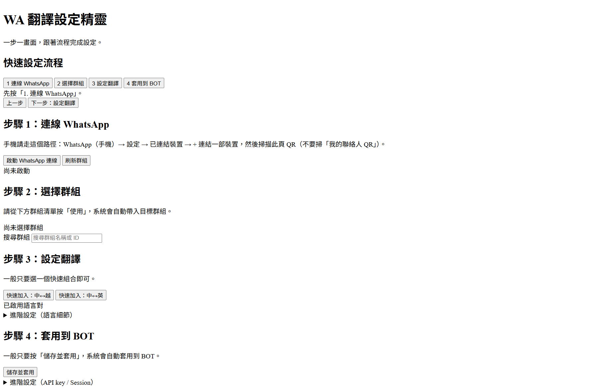
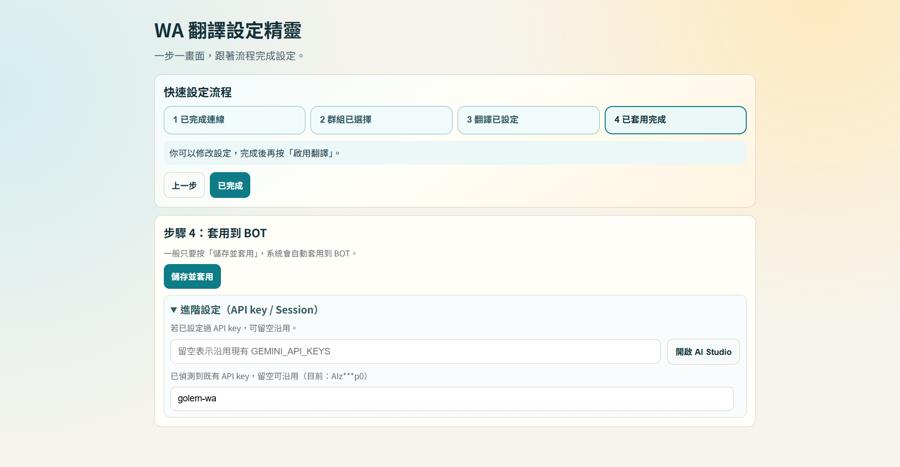
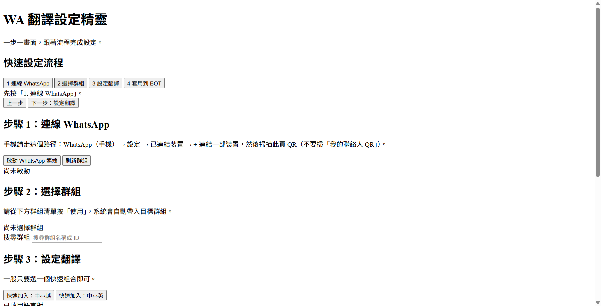
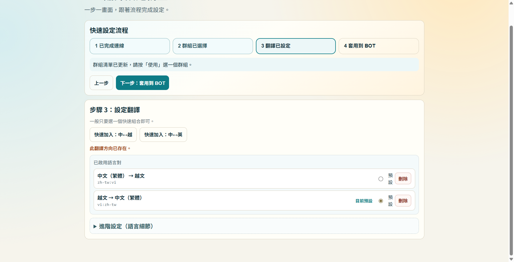
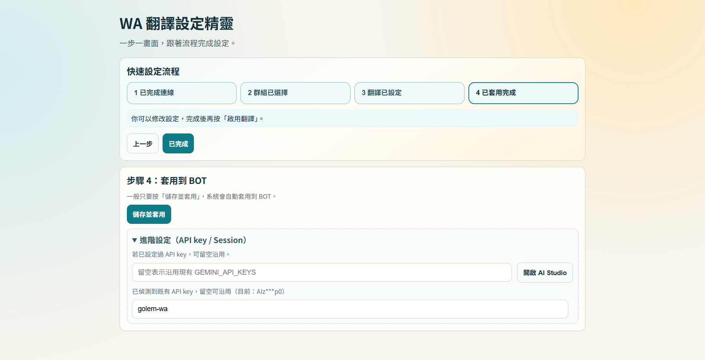
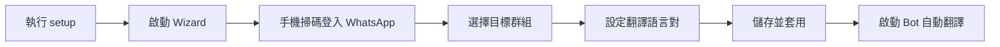
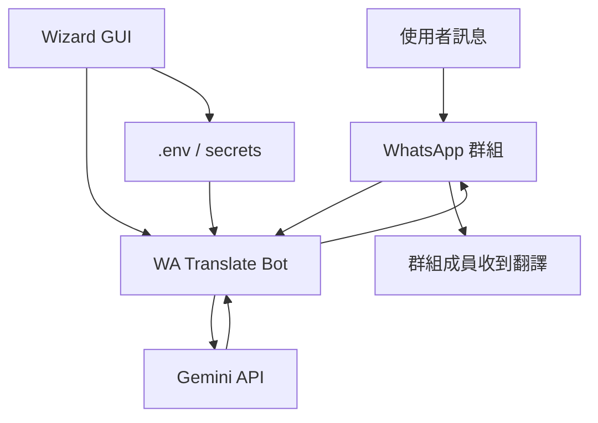

# WA Translate

> 把 WhatsApp 群組直接升級成「多語聊天室」：掃碼一次、選好群組、即時翻譯自動運作。


專注 **WhatsApp 群組翻譯** 的實戰版本，內建 GUI 設定精靈與 Docker 一鍵部署流程，適合快速交付給團隊成員直接使用。

## 為什麼用 WA Translate

- **3 分鐘可上線**：`setup.bat` / `setup.sh` 引導式安裝
- **跨語即時溝通**：支援多組語言對，群組內直接切換模式
- **管理成本低**：GUI 一次完成掃碼、選群組、儲存與套用
- **交付友善**：可用 Git 交接，不必手動講解複雜步驟

## 真實畫面（Wizard UI）

### 畫面 1：快速設定總覽



### 畫面 2：進階設定（語言細節 / API key / Session）



## 操作步驟（真實畫面）

### 步驟 1：連線 WhatsApp（點「1 連線 WhatsApp」）


### 步驟 2：選擇群組（點「2 選擇群組」）



### 步驟 3：設定翻譯（點「3 設定翻譯」）



### 步驟 4：套用到 BOT（點「4 套用到 BOT」）



## 畫面與流程（Visual）





## 核心功能

- 指定一個 WhatsApp 群組自動翻譯
- 支援多組語言對（例如 `zh-tw:vi,vi:zh-tw,en:zh-tw`）
- 可在群組中用 `/mode` 切換當前翻譯模式
- 提供 GUI 設定精靈，快速取得 Admin ID、群組 ID 與語言模式

## 環境需求

- Docker Desktop（或 Docker Engine + Compose）
- WhatsApp 可掃碼登入
- Gemini API Key

## 一般使用者（建議）

### Windows

1. 下載並解壓專案
2. 雙擊 `setup.bat`
3. 依提示輸入 Gemini API Key
4. 若偵測到 `secrets/gemini_api_keys.txt` 為空，安裝器會自動要求重填並修復
5. 瀏覽器會自動開啟設定頁（對照下方真實畫面）
6. 在 Wizard 依序完成「連線 WhatsApp → 選擇群組 → 設定翻譯 → 儲存並套用」
7. 雙擊 `start-bot.bat` 啟動翻譯

### macOS / Linux

1. 在專案目錄執行 `chmod +x setup.sh start-bot.sh stop-bot.sh`
2. 執行 `./setup.sh`
3. 依提示輸入 Gemini API Key
4. 若 `secrets/gemini_api_keys.txt` 不存在或為空，安裝器會自動要求重填
5. 在 Wizard 依序完成「連線 WhatsApp → 選擇群組 → 設定翻譯 → 儲存並套用」
6. 設定完成後執行 `./start-bot.sh`

## 用 Git 交付給其他人

1. 推薦使用 private repository。
2. 請勿提交敏感檔案：`.env`、`secrets/`、`.wwebjs_auth/`、`.wwebjs_cache/`（已在 `.gitignore`）。
3. 交付端推送：

```bash
git add .
git commit -m "chore: prepare handoff"
git push origin main
```

4. 接手端安裝：

```bash
git clone <repo-url>
cd WA-Translate
```

Windows：

```bat
setup.bat
```

macOS / Linux：

```bash
chmod +x setup.sh start-bot.sh stop-bot.sh
./setup.sh
```

## 快速開始（Docker）

1. 複製環境檔：

```bash
cp .env.example .env
```

2. 建立 Docker secret 檔案（建議）：

```bash
mkdir -p secrets
printf "your_key_1,your_key_2\n" > secrets/gemini_api_keys.txt
```

或一行一把 key：

```text
your_key_1
your_key_2
```

3. 啟動設定精靈：

```bash
docker compose up -d wizard
```

或使用：

```bash
npm run docker:wizard
```

4. 開啟設定頁（主機瀏覽器）：

```text
http://localhost:38765
```

5. 在精靈按「儲存並套用」即可套用到 bot（GUI 一次完成）：

- 若 bot 已在執行，精靈會自動觸發 bot reload 套用新設定
- 若 bot 尚未執行，再手動啟動一次 bot

```bash
docker compose up -d bot
```

或使用：

```bash
npm run docker:bot
```

6. 查看狀態與日誌：

```bash
docker compose ps
docker compose logs -f bot
```

`docker compose ps` 會顯示 `healthy` / `unhealthy`（已內建 healthcheck）。

## 一次掃碼流程（建議）

`wizard` 與 `bot` 會共用 `.env` 的 `WHATSAPP_SESSION_CLIENT_ID`。  
首次設定時建議流程：

1. 先只開 `wizard`，按三個主按鈕完成流程：連線 WhatsApp → 選擇群組 → 啟用翻譯
2. 「進階設定（可選）」預設收合，只有首次未設定 API key 才需要展開
3. 按「儲存並套用」（會自動儲存並套用到 bot）
4. 直接在群組測試訊息

說明：精靈在啟動連線時會自動暫停 bot，套用後再恢復 bot 連線。

## 手機管理（安全模式）

- 預設 `wizard` 只綁定本機 `127.0.0.1`（降低同網段被掃描風險）
- 若要用手機開設定頁，建議走 Tailscale / 內網 VPN
- 若你改為對外綁定（`WIZARD_HOST=0.0.0.0`），請同時啟用 token（預設會自動要求）
- 啟動日誌會顯示含 `?token=...` 的完整網址，手機請用該網址進入

## Docker 常用指令

- 停止所有服務：`docker compose down`
- 重新建置映像：`docker compose build --no-cache`
- 只重啟 bot：`docker compose up -d --force-recreate bot`
- 健康巡檢：`npm run docker:check`
- 一鍵修復 + 巡檢：`npm run docker:fix`
- npm 快捷：`npm run docker:build`、`npm run docker:wizard`、`npm run docker:bot`、`npm run docker:down`、`npm run docker:logs`、`npm run docker:check`、`npm run docker:fix`
- GUI 版快捷檔：`setup.bat` / `setup.sh`、`start-bot.bat` / `start-bot.sh`、`stop-bot.bat` / `stop-bot.sh`

## CI 自動檢查

- 已提供 GitHub Actions：`.github/workflows/docker-health.yml`
- 每次 `push` 到 `main/master` 與 `pull_request` 都會自動執行 Docker build、啟動 `wizard/bot`，並等待健康檢查通過

## 群組指令

- `/help` 顯示說明
- `/gid` 顯示目前群組 ID
- `/status` 顯示目前翻譯模式
- `/mode` 列出可用模式
- `/mode <source:target>` 切換翻譯模式（例如 `/mode zh-tw:vi`）

## .env 範例

```env
# 建議留空，改由 Docker secret 提供
GEMINI_API_KEYS=
GEMINI_API_KEYS_FILE=/run/secrets/gemini_api_keys
WHATSAPP_ENABLED=true
WHATSAPP_ADMIN_ID=8869xxxxxxx@c.us
WHATSAPP_TRANSLATE_GROUP_ID=1203xxxxxxxxxx@g.us
WHATSAPP_TRANSLATE_INCLUDE_FROM_ME=true
WHATSAPP_SESSION_CLIENT_ID=wa-translate
BOT_CONTROL_TOKEN=change-this-to-a-long-random-token
GEMINI_TIMEOUT_MS=45000
GEMINI_MAX_RETRIES_PER_KEY=1
TRANSLATE_QUEUE_MAX_SIZE=100
CHROME_PATH=
TRANSLATE_PAIRS=zh-tw:vi,vi:zh-tw,en:zh-tw
DEFAULT_PAIR=zh-tw:vi
```

## Docker 資料安全基線

- Bot/Wizard 服務預設啟用 `no-new-privileges`、`cap_drop: ALL`
- Bot 控制端點（`/reload`、`/wa/pause`、`/wa/resume`）會驗證 `BOT_CONTROL_TOKEN`，請務必改成高熵隨機字串
- 機密建議放 `secrets/gemini_api_keys.txt`（已在 `.gitignore` 忽略）
- WhatsApp session 存於 `./.wwebjs_auth`、`./.wwebjs_cache`，請定期備份並限制主機目錄權限
- Wizard API 不再回傳 Gemini key 明文，UI 只顯示遮罩狀態

在 Docker 中已預設使用容器內 Chromium，不需要手動設定 `CHROME_PATH`。

## 本機模式（非 Docker）

仍可使用原本方式（開發者向）：

- `npm run config:gui`
- `npm start`
